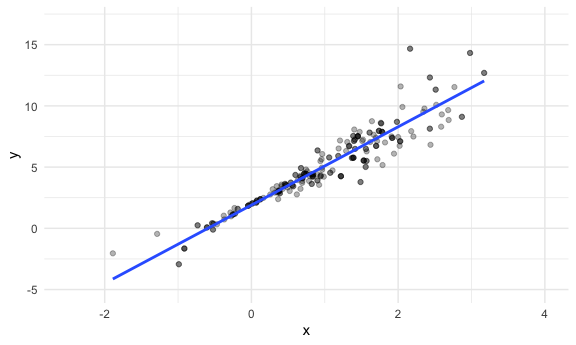
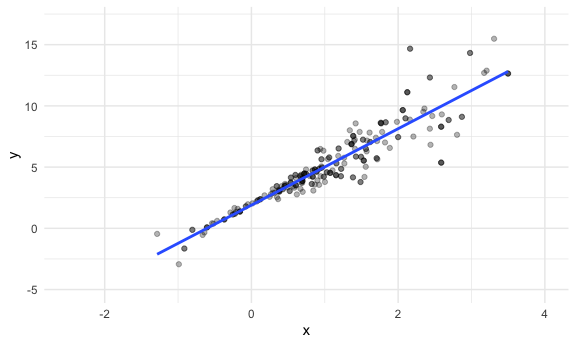
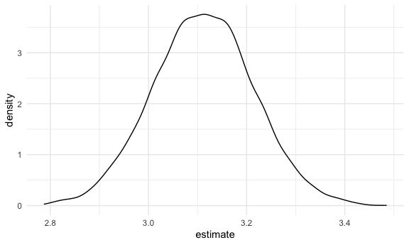

bootstrapping
================
Shivalika Chavan
2025-11-13

Simulate two data sets

``` r
set.seed(1)

n_samples = 250

sim_df_constant = 
  tibble(
    x = rnorm(n_samples, mean = 1, sd = 1),
    error = rnorm(n_samples, mean = 0, sd = 1),
    y = 2 + 3 * x + error
  )

sim_df_nonconstant = 
  sim_df_constant |> 
  mutate(
    error = error * .75 * x,
    y = 2 + 3 * x + error
  )
```

Plotting

``` r
sim_df_constant |> 
  ggplot(aes(x = x, y = y)) + 
  geom_point()
```


``` r
sim_df_nonconstant |> 
  ggplot(aes(x = x, y = y)) + 
  geom_point()
```


Linear Models on these?

``` r
sim_df_constant |> 
  lm(y ~ x, data = _) |> 
  broom::tidy() |> 
  knitr::kable(digits = 3)
```

| term        | estimate | std.error | statistic | p.value |
|:------------|---------:|----------:|----------:|--------:|
| (Intercept) |    1.977 |     0.098 |    20.157 |       0 |
| x           |    3.045 |     0.070 |    43.537 |       0 |

``` r
sim_df_nonconstant |> 
  lm(y ~ x, data = _) |> 
  broom::tidy() |> 
  knitr::kable(digits = 3)
```

| term        | estimate | std.error | statistic | p.value |
|:------------|---------:|----------:|----------:|--------:|
| (Intercept) |    1.934 |     0.105 |    18.456 |       0 |
| x           |    3.112 |     0.075 |    41.661 |       0 |

Drawing a bootstrap sample

``` r
boot_sample = function(df){
  
  sample_frac(df, size = 1, replace = TRUE)
  
}
```

Doing the function

``` r
sim_df_nonconstant |> 
  boot_sample() |> 
  ggplot(aes(x = x, y = y)) + 
  geom_point(alpha = 0.3) +
  geom_smooth(method = "lm", se = FALSE) + 
  xlim(-2.5, 4) + ylim(-5, 17)
```

    ## `geom_smooth()` using formula = 'y ~ x'



Formalizing and extracting results

``` r
boot_straps = 
  tibble(iter = 1:5000) |> 
  mutate(
    strap_sample = map(iter, \(i) boot_sample(df = sim_df_nonconstant))
  )

boot_straps
```

    ## # A tibble: 5,000 × 2
    ##     iter strap_sample      
    ##    <int> <list>            
    ##  1     1 <tibble [250 × 3]>
    ##  2     2 <tibble [250 × 3]>
    ##  3     3 <tibble [250 × 3]>
    ##  4     4 <tibble [250 × 3]>
    ##  5     5 <tibble [250 × 3]>
    ##  6     6 <tibble [250 × 3]>
    ##  7     7 <tibble [250 × 3]>
    ##  8     8 <tibble [250 × 3]>
    ##  9     9 <tibble [250 × 3]>
    ## 10    10 <tibble [250 × 3]>
    ## # ℹ 4,990 more rows

Quick check

``` r
boot_straps |> 
  pull(strap_sample) |> 
  nth(2) |> 
  ggplot(aes(x = x, y = y)) + 
  geom_point(alpha = 0.3) +
  geom_smooth(method = "lm", se = FALSE) + 
  xlim(-2.5, 4) + ylim(-5, 17)
```

    ## `geom_smooth()` using formula = 'y ~ x'



Actually running analysis

``` r
bootstrap_results = 
  boot_straps |> 
  mutate(
    fits = map(strap_sample, \(df) lm(y~x, data = df)),
    results = map(fits, broom::tidy)
    )
```

Look at results:

``` r
bootstrap_results |> 
  select(iter, results) |> 
  unnest(results) |> 
  group_by(term) |> 
  summarize(
    mean = mean(estimate),
    se = sd(estimate)
  )
```

    ## # A tibble: 2 × 3
    ##   term         mean     se
    ##   <chr>       <dbl>  <dbl>
    ## 1 (Intercept)  1.93 0.0762
    ## 2 x            3.11 0.103

Look at these

``` r
bootstrap_results |> 
  select(iter, results) |> 
  unnest(results) |> 
  filter(term == "x") |> 
  ggplot(aes(x = estimate)) + 
  geom_density()
```



``` r
bootstrap_results |> 
  select(iter, results) |> 
  unnest(results) |> 
  group_by(term) |> 
  summarize(
    ci_lower = quantile(estimate, 0.025),
    ci_upper = quantile(estimate, 0.975)
  )
```

    ## # A tibble: 2 × 3
    ##   term        ci_lower ci_upper
    ##   <chr>          <dbl>    <dbl>
    ## 1 (Intercept)     1.78     2.09
    ## 2 x               2.91     3.32
