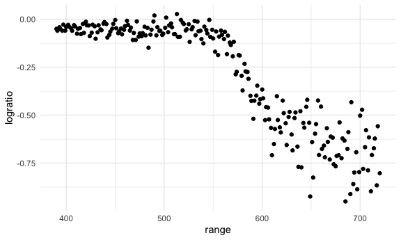
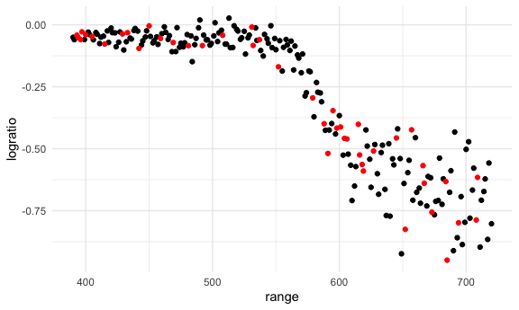
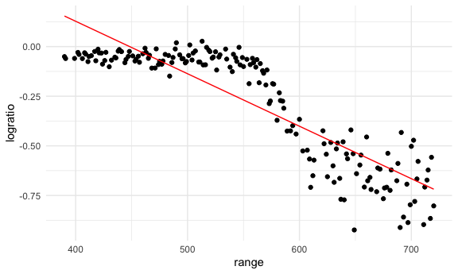
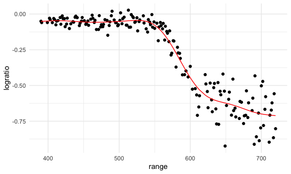
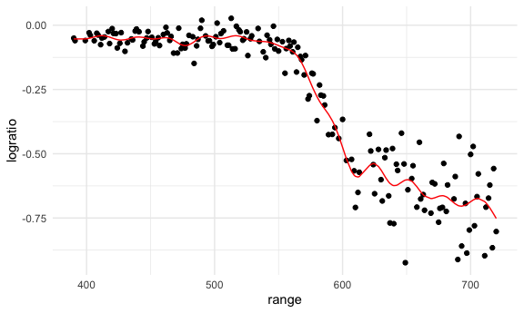
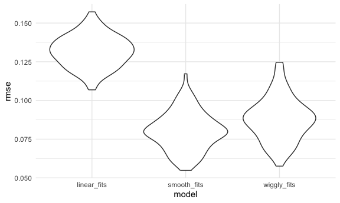

cross_validation
================
Shivalika Chavan
2025-11-11

``` r
data("lidar")

lidar_df = 
  lidar |> 
  mutate(id = row_number())

lidar_df |> 
  ggplot(aes(x = range, y = logratio)) + 
  geom_point()
```



``` r
train_df = sample_frac(lidar_df, size = .8) |> 
  arrange(id)
test_df = anti_join(lidar_df, train_df, by = "id")
```

Look at the train and test df

``` r
ggplot(train_df, aes(x = range, y = logratio)) + 
  geom_point() + 
  geom_point(data = test_df, color = "red")
```



Fit a few models to the training data `train_df`

``` r
linear_model = lm(logratio ~ range, data = train_df)
smooth_model = gam(logratio ~ s(range), data = train_df) #Generalized additive model (anything that's non-linear), range is smoothed
wiggly_model = gam(logratio ~ s(range, k = 30), sp = 10e-6, , data = train_df) # using 30 polynomials, sp smoothing parameter by not a lot
```

Looking at `linear_model`

``` r
train_df |> 
  add_predictions(linear_model) |> 
  ggplot(aes(x = range, y = logratio)) +
  geom_point() +
  geom_line(aes(y = pred), color = "red")
```



Looking at `smooth_model`

``` r
train_df |> 
  add_predictions(smooth_model) |> 
  ggplot(aes(x = range, y = logratio)) +
  geom_point() +
  geom_line(aes(y = pred), color = "red")
```



Looking at `wiggly_model`

``` r
train_df |> 
  add_predictions(wiggly_model) |> 
  ggplot(aes(x = range, y = logratio)) +
  geom_point() +
  geom_line(aes(y = pred), color = "red")
```



Computing RMSE

``` r
rmse(linear_model, data = test_df)
```

    ## [1] 0.127317

``` r
rmse(smooth_model, data = test_df)
```

    ## [1] 0.08302008

``` r
rmse(wiggly_model, data = test_df)
```

    ## [1] 0.08848557

Automating 100 iterations of CV train/test split. Defaults to 80/20
split

``` r
cv_df = crossv_mc(lidar_df, n = 100) |> 
  mutate(
    train = map(train, as_tibble),
    test = map(test, as_tibble)
  )
```

``` r
cv_df |> pull(train) |> nth(3)
```

    ## # A tibble: 176 × 3
    ##    range logratio    id
    ##    <dbl>    <dbl> <int>
    ##  1   390  -0.0504     1
    ##  2   391  -0.0601     2
    ##  3   393  -0.0419     3
    ##  4   394  -0.0510     4
    ##  5   396  -0.0599     5
    ##  6   399  -0.0596     7
    ##  7   400  -0.0399     8
    ##  8   402  -0.0294     9
    ##  9   403  -0.0395    10
    ## 10   405  -0.0476    11
    ## # ℹ 166 more rows

Fitting models again and again

``` r
cv_df = 
  cv_df |> 
  mutate(
    # Using anonymous function
    linear_fits = map(train, \(df) lm(logratio ~ range, data = df)),
    smooth_fits = map(train, \(df) gam(logratio ~ s(range), data = df)),
    wiggly_fits = map(train, \(df) gam(logratio ~ s(range, k = 30), sp = 10e-6, , data = df))
  ) |> 
  mutate(
    rmse_linear_fits = map2_dbl(linear_fits, test, rmse),
    rmse_smooth_fits = map2_dbl(smooth_fits, test, rmse),
    rmse_wiggly_fits = map2_dbl(wiggly_fits, test, rmse)
  )
```

Looking at distribution of RMSE

``` r
cv_df |> 
  select(starts_with("rmse")) |> 
  pivot_longer(
    everything(),
    names_to = "model", 
    values_to = "rmse",
    names_prefix = "rmse_") |> 
  mutate(model = fct_inorder(model)) |> 
  ggplot(aes(x = model, y = rmse)) + 
  geom_violin()
```


